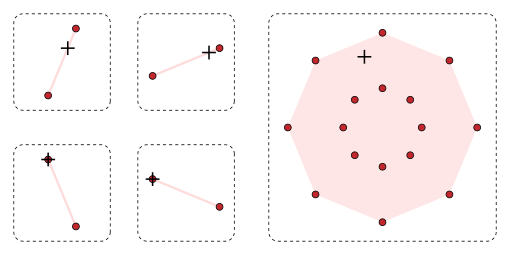

# Introduction

This is the first of what I hope to be many posts, because I have a tendency to start doing things and stop doing them after a month or so when I get tired of it. I plan to do this every 3 months, and in between I also hope to post things if I find them particularly interesting (interesting enough to spend time writing about). Refer to the about page for why I started writing this stuff.

The joke for those who don't know is that every quarter a big batch of options expire and people call it the quarterly opex. I thought about how long it would take for my thoughts to form enough sediment to be worth digging up and putting into a long written ramble, and it's around 3 months. Since this is the first time I am writing this, and I started writing this because I realized I had too many pent up ideas that had to be written down, it means this quarterly opex post will probably be longer than the next few. It will also include things I have thought about in the distant past, and not necessarily just the past 3 months.

I plan to structure most of my quarterly opex posts in the following fashion: some interesting math topics I came across over the past period, followed by some random topics I've thought about (will probably always include a section on music), followed by a section on finance. The reason why it is ordered this way is that there are a lot of things in finance that are basically some idea from the random thoughts section but expressed in a finance way. And math is the first section because math comes first.

## Content links
- [Math](#math){: .page-link}

## Math

### The centrifuge problem

[<u>Here's the link to a write-up on it.</u>](https://mattbaker.blog/2018/06/25/the-balanced-centrifuge-problem/){: .page-link} This is just a cool problem. I thought at first that it had to do with some properties of the cosets of finite rings but it turned out to be something else entirely.

### Graph colorability

If you want to figure out whether a graph is k-colorable, you can just encode it using its graph polynomial, $\prod_{\lbrace u,v \rbrace \in E}\,(u-v)$, and calculate the Gr&ouml;bner basis of this and $v^k - 1$ for $v \in V$. Clearly if 1 is in the basis then you know it's k-colorable, else there would be some pair of adjacent vertices with the same color (represented by a k-th root of unity). This isn't so much of a big complicated fact as it is something to make computation easier.

### Shapley-Folkman

Speaking of Gr&ouml;bner bases, there are lots of mathematical objects that admit some form of deconstruction into "bases" or smaller generating elements that serve a similar role. There's bases for vector spaces and topologies (sometimes the properties of local bases are not satisfied by the bases for the whole space). You can generate $(\mathbb{Z}, +)$ with {1}, and $(\mathbb{Z}, \times)$ is not a group but you can kind of see it being "generated" with 1 and the primes.

Anyways, Shapley-Folkman is a nice result that says: if you have a convex hull in $\mathbb{R}^m$ generated from the Minkowski addition of $n$ sets $S_i$, you can find some representation of ANY point in the convex hull as the sum of only $m$ points in the convex hulls of some $S_i$, and the rest of the $n-m$ points can just be in $S_i$ directly. Here's a pic I stole from Wikipedia to illustrate:

    

There's 4 points in 2 dimensions. The lemma states that to get to point +, you just need to adjust the "inputs" in two of the sets within their convex hull, and the other sets can just "freeload" there.

The proof of this is a nice pigeonhole argument. Say we have point $x \in conv(S)$ that we want to represent ($S$ is the Minkowski sum of the $S_i$). We know we can just take some $y_i \in conv(S_i)$ such that they sum to $x$. Then, we represent each of these $y_i$ as a convex sum of $z_{i,j} \in S_i$. Essentially, we represent $x$ as the sum of points in all the convex hulls (none of the "inputs" are "freeloading") and represent those inputs as a convex sum.

Next, we attach $n$ more 1's to $x$, and for each $z_{i,j}$ we append $(0,...,1,...,0)$ where the 1 comes at the i-th position. Since for each $i$, $y_i = \sum a_{i,j}z_{i,j}$ for $\sum a_{i,j} = 1$, after we add the $n$ new dimensions at the end we get the same relation. Therefore, $x' = \sum_{i} \sum_{j} a_{i,j}z'_{i,j}$.

The point of doing this was to make all the $z_{i,j}$ turn into unique points in $\mathbb{R}^{m+n}$. Now we can just use Carath&eacute;odory's theorem and say $x'$ is the sum of $m+n$ of the $z'$ and that the rest can have $a_{i,j} = 0$.

We can now remove all the extra 1's we added to go back to $\mathbb{R}^{m}$. Remember that $y_i = \sum a_{i,j}z_{i,j}$. We know there are $m+n$ nonzero values of $a_{i,j}z_{i,j}$ and $n$ of $y_{i}$ in total. Therefore by the pigeonhole principle, only $m$ of them have multiple nonzero values of $a_{i,j}z_{i,j}$, and the rest only have 1 value and thus satisfy $y_{i} \in S_{i}$ (freeloaders).

I think of this as a kind of "basis" representation of that point in the convex hull. You can specify points in large complicated sets with just a small number of values, bounded by the dimension of the set.

### Tutte polynomials

There are two characterizations of Tutte polynomials. One is the intuitive recursive version that quite literally counts bridges and loops. The other is $T_{G}(x,y) = \sum_{A \subseteq E}\,(x-1)^{k(A)-k(E)}(y-1)^{k(A)+|A|-|V|}$ where $k(A)$ is the number of connected components of the subgraph $A$. It is easy to prove that the summation version satisfies the properties of the recursive equation but not so easy to prove the other direction (that it is the only formula to satisfy this). That is probably something I will only figure out in university.

The reason I came across this was because apparently, $T(1,1)$ satisfies the same function as Kirchhoff's theorem, that the number of spanning trees of a graph is equal to the determinant of any cofactor of the graph Laplacian.

On the topic of graph Laplacians, something else I've been putting off for a while now is reading an article about chip-firing games. This is why I have 100 tabs open at any time because I keep saving things to read later but never actually read them.

-
Uploading a test version to see if the Mathjax works